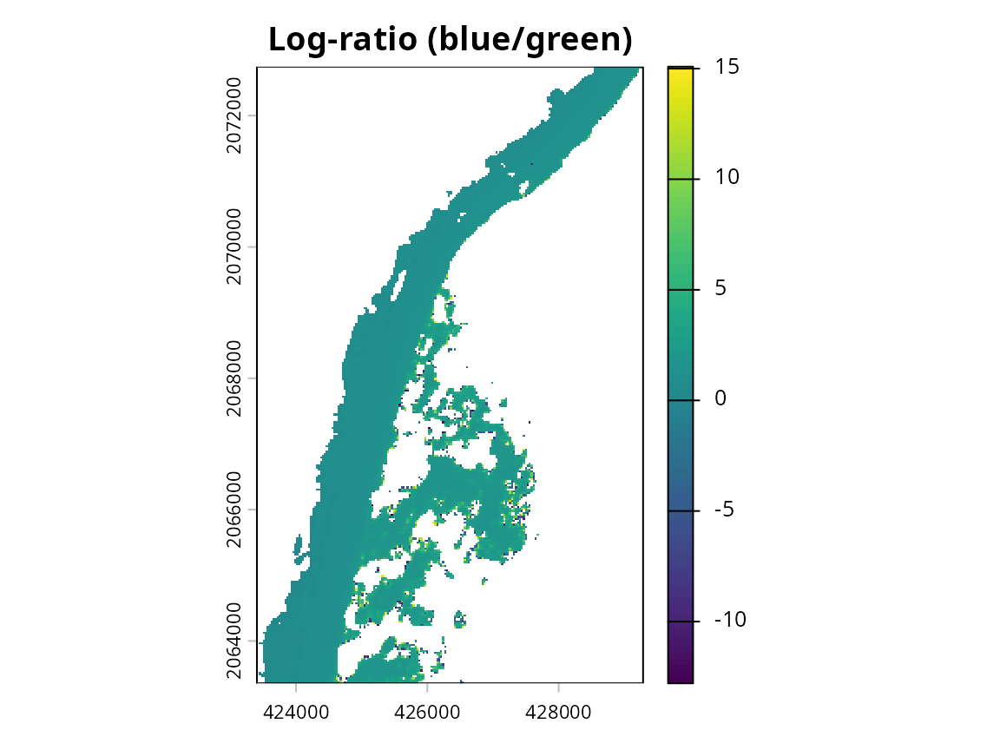
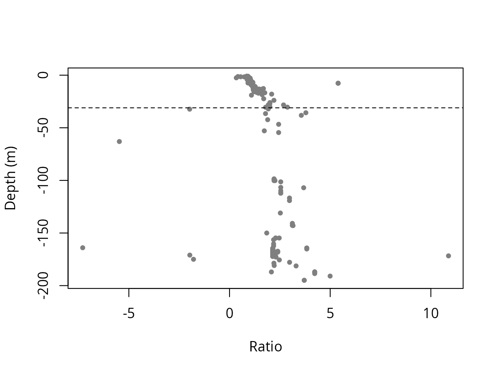
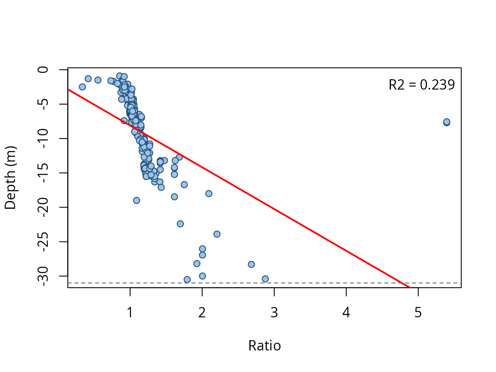

# Getting started with satbathy

## Overview

**satbathy** estimates water depth in shallow, low-turbidity coastal
waters from multispectral satellite imagery using the empirical
log-ratio transform of Stumpf, Holderied and Sinclair (2003). The idea
is simple: two visible bands (typically blue and green) are attenuated
at different rates as depth increases, so the ratio of their
log-transformed reflectance is, over a useful range, linearly related to
depth. That linear relationship is calibrated with a handful of in situ
soundings and then applied to the whole image.

This vignette walks through the full workflow on the bundled example
dataset, a Landsat scene with in situ bathymetry from Mahahual, on the
Mexican Caribbean coast.

``` r
library(satbathy)
library(terra)

img  <- rast(system.file("extdata", "example_sr.tif",     package = "satbathy"))
pts  <- vect(system.file("extdata", "example_points.gpkg", package = "satbathy"))
deep <- vect(system.file("extdata", "example_deepmask.gpkg", package = "satbathy"))

img
#> class       : SpatRaster
#> size        : 313, 196, 5  (nrow, ncol, nlyr)
#> resolution  : 30, 30  (x, y)
#> extent      : 423405, 429285, 2063355, 2072745  (xmin, xmax, ymin, ymax)
#> coord. ref. : WGS 84 / UTM zone 16N (EPSG:32616)
#> source      : example_sr.tif
#> names       :   coastal,     blue,     green,      red,       nir
#> min values  : -0.062473, -0.05271, -0.030242, -0.03368, -0.019462
#> max values  :  0.130357, 0.192865,  0.243905,  0.17939,  0.100135
```

The image holds five surface-reflectance bands named `coastal`, `blue`,
`green`, `red` and `nir`. The points carry a `depth` attribute (metres,
negative below the surface).

## 1. Selecting clear-water dates

The ratio transform performs best in clear water, so the first practical
step is to pick the least turbid dates from an image time series.
[`turbidity_index()`](https://jfmas.github.io/satbathy/reference/turbidity_index.md)
implements the index of Frohn and Autrey (2009), `(green + red) / blue`;
lower values mean clearer water. Here we simply summarise it for the
single example scene.

``` r
turb <- turbidity_index(img)
global(turb, "mean", na.rm = TRUE)
#>                mean
#> turbidity 0.8363226
```

In practice you would compute this index for every date and choose the
minima (for example with a moving-average smoother over the time
series).

## 2. Masking land and clouds

Only water pixels should enter the model. When a sensor quality band is
not available, a threshold on the Normalized Difference Water Index
works well:

``` r
wm <- water_mask(img, green = "green", nir = "nir", threshold = 0)
img_water <- mask(img, wm, maskvalues = c(FALSE, NA))
```

**Sensor-specific preprocessing.** The bundled image is already surface
reflectance, cropped and land/cloud masked. Producing such an image from
raw archives depends on the sensor and is intentionally left outside the
package, but the recipe is:

- **Landsat 8/9 (Collection 2 L2).** Scale the `SR_B*` bands with the
  `REFLECTANCE_MULT_BAND` / `REFLECTANCE_ADD_BAND` values in the MTL
  metadata, and build masks from the `QA_PIXEL` bit flags (water bit;
  dilated cloud, cirrus, cloud and cloud-shadow bits).
- **Sentinel-2 (L2A).** Use the Scene Classification Layer (`SCL`) to
  keep water and discard clouds and shadows; reflectance is the `B*`
  bands divided by the quantification value.
- **PlanetScope / SuperDove (L2 SR).** There is no reliable water class
  in the UDM2 mask, so derive a water mask from the NDWI as above with
  [`ndwi()`](https://jfmas.github.io/satbathy/reference/ndwi.md) /
  [`water_mask()`](https://jfmas.github.io/satbathy/reference/water_mask.md).

## 3. Optional glint and smoothing

Sun glint can be removed with the image-based method of Hedley et
al. (2005), which regresses each visible band on the near-infrared over
optically deep water (supplied as a polygon mask). A low-pass filter
then reduces residual speckle. Both steps are optional and, in very
calm, uniform waters, make little difference.

``` r
img_gc <- correct_glint(img_water, vis_bands = c("blue", "green"),
                        nir_band = "nir", deep_mask = deep)
img_gc <- lowpass_filter(img_gc)
```

## 4. The log-ratio transform

``` r
ratio <- log_ratio(img_gc, blue = "blue", green = "green", n = 10000)
plot(ratio, main = "Log-ratio (blue/green)")
```



Darker offshore tones correspond to higher ratio values, i.e. greater
depth.

## 5. Calibration

Pair the ratio with the in situ depths, then decide how deep the signal
is reliable.
[`optimal_max_depth()`](https://jfmas.github.io/satbathy/reference/optimal_max_depth.md)
refits the model for a decreasing sequence of maximum-depth thresholds:
goodness of fit rises as the linear range fills in and then drops once
saturated (too-deep) points are included.

``` r
tab <- extract_ratio(ratio, pts, depth_field = "depth")

md <- optimal_max_depth(tab)
plot(md$max_depth, md$r2, type = "b",
     xlab = "Maximum depth (m)", ylab = "Adjusted R-squared")
```


``` r

best <- md$max_depth[which.max(md$r2)]
best
#> [1] -31
```

The scatter makes the saturation explicit: beyond the penetration limit
the ratio no longer increases with depth.

``` r
plot(tab$ratio, tab$depth, pch = 20, col = "grey50",
     xlab = "Ratio", ylab = "Depth (m)")
abline(h = best, lty = 2)
```



Now fit the model over its valid range and inspect it:

``` r
fit <- fit_bathymetry(tab, max_depth = best)
fit
#> <satbathy_model>
#>   depth = -2.036 + -6.072 * ratio
#>   points: 277   (max_depth = -31 m)
#>   adjusted R-squared: 0.239
plot(fit)
```



## 6. Depth map and accuracy

Apply the calibrated model to the ratio raster to obtain a depth map:

``` r
depth_map <- predict_bathymetry(fit, ratio)
plot(depth_map, main = "Satellite-derived bathymetry (m)")
```


For an honest error estimate, hold out independent points within the
valid depth range and score them with
[`evaluate_bathymetry()`](https://jfmas.github.io/satbathy/reference/evaluate_bathymetry.md):

``` r
valid <- tab[tab$depth > best, ]
set.seed(1)
i <- sample(nrow(valid), round(0.7 * nrow(valid)))
train <- valid[i, ]
test  <- valid[-i, ]

fit_tr <- fit_bathymetry(train)
evaluate_bathymetry(fit_tr, test)
#>    n     rmse      mae
#> 1 83 12.25251 4.068439
```

## References

- Frohn RC, Autrey BC (2009). *Water quality assessment in the Ohio
  River using new indices for turbidity and chlorophyll-a with Landsat-7
  imagery.* U.S. EPA.
- Hedley JD, Harborne AR, Mumby PJ (2005). *Simple and robust removal of
  sun glint for mapping shallow-water benthos.* International Journal of
  Remote Sensing 26(10):2107-2112.
- McFeeters SK (1996). *The use of the Normalized Difference Water Index
  (NDWI) in the delineation of open water features.* International
  Journal of Remote Sensing 17(7):1425-1432.
- Stumpf RP, Holderied K, Sinclair M (2003). *Determination of water
  depth with high-resolution satellite imagery over variable bottom
  types.* Limnology and Oceanography 48(1, part 2):547-556.
